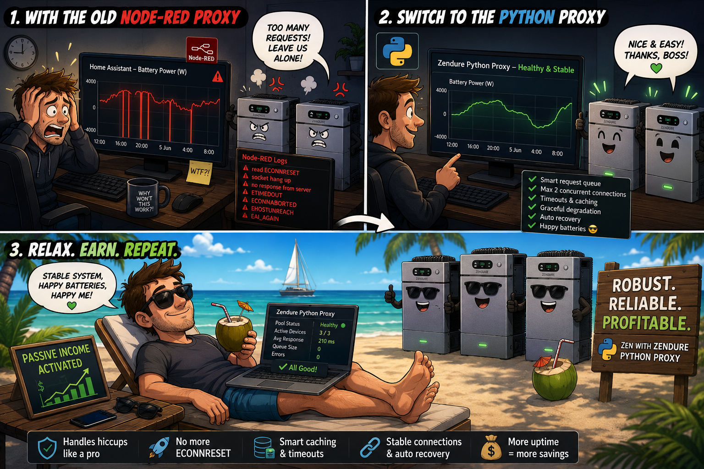

# Zendure zenSDK Proxy



> A resilient AppDaemon bridge between Home Assistant and Zendure devices.
>
> In concrete terms, `ZendureProxy` exposes Zendure report and write endpoints,
> publishes Home Assistant sensors, shows AppDaemon log and metrics pages, and
> sends queued HTTP requests to each configured Zendure IP address.

Credit: this AppDaemon version builds on the original
[`Zendure-zenSDK-proxy`](https://github.com/gast777/Zendure-zenSDK-proxy)
by Casper Rijnders / `gast777`.

The repository is still experimental. Practical testing, clear bug reports, and
small pull requests are welcome.

## Contents

- [Credits and upstream](#credits-and-upstream)
- [What the AppDaemon app does](#what-the-appdaemon-app-does)
- [Handling slow or unavailable Zendures](#handling-slow-or-unavailable-zendures)
- [Install with HACS](#install-with-hacs)
- [Configure AppDaemon](#configure-appdaemon)
- [URLs for Gielz and Home Assistant](#urls-for-gielz-and-home-assistant)
- [Home Assistant automations](#home-assistant-automations)
- [Degraded pool notification](#degraded-pool-notification)
- [Sensors and MQTT discovery](#sensors-and-mqtt-discovery)
- [Logging](#logging)
- [Metrics and dashboards](#metrics-and-dashboards)
- [Queue model](#queue-model)
- [Reserve mode](#reserve-mode)
- [Relay saver mode](#relay-saver-mode)
- [Move from Node-RED to AppDaemon](#move-from-node-red-to-appdaemon)
- [HACS release note for maintainers](#hacs-release-note-for-maintainers)
- [Intentional difference from Node-RED with three or more Zendures](#intentional-difference-from-node-red-with-three-or-more-zendures)

## Credits and upstream

This repository is based on the original
[`gast777/Zendure-zenSDK-proxy`](https://github.com/gast777/Zendure-zenSDK-proxy)
by Casper Rijnders.

The original repository provides a Node-RED proxy for Gielz/Home Assistant and
Zendure devices. The Node-RED proxy talks to multiple Zendure devices, combines
device state into one virtual device, distributes charge and discharge power,
and adds extra monitoring attributes for Home Assistant.

This fork adds an AppDaemon/Python implementation. The file list for the
AppDaemon/Python addition is in [`LICENSE`](LICENSE).

Thank you to `gast777` for the Zendure interface work, the proxy approach, the
power distribution logic, the monitoring attributes, the Home Assistant
examples, and the practical testing that made this AppDaemon version possible.

The Node-RED files, the documentation for the original proxy approach, and the
Home Assistant examples still come from the upstream repository by `gast777`,
except where this fork explicitly adds AppDaemon or HACS documentation. The
Node-RED implementation is unchanged and remains the reference for REST fields,
Gielz compatibility, and existing Home Assistant examples.

## What the AppDaemon app does

`ZendureProxy` has six concrete goals on top of the upstream Node-RED proxy:

1. Keep compatibility with the proxy by `gast777`. Existing Gielz dashboards,
   Home Assistant sensors, and REST calls can keep using the same proxy
   response fields.
2. Install and update through HACS. A user can install the AppDaemon version
   through HACS and upgrade through HACS without importing a Node-RED export.
3. Handle short Zendure outages more gently. `ZendureProxy` keeps Gielz working
   where possible, and `ZendureProxy` keeps following the requested power as
   closely as possible when one Zendure is slow or unavailable.
4. Avoid request backlogs after a short outage. `RequestQueue.drain()` combines
   queued GET requests and deduplicates queued POST requests, so old or duplicate
   commands are not sent after Home Assistant has already sent newer commands.
5. Make per-device problems visible. `MetricsRegistry` shows when a specific
   Zendure responds slowly, times out, or returns errors.
6. Control more physical Zendures directly. `devices:` and `ip_zendure_1`
   through `ip_zendure_10` can configure up to 10 Zendures. `charge_max_watts`
   and `discharge_max_watts` can set a lower per-Zendure charge or discharge
   limit than the hardware values `chargeMaxLimit` and `inverseMaxPower`.

The AppDaemon app provides these user-facing pieces:

- Legacy report and write URLs on port `8120` for Gielz and existing REST users.
- AppDaemon API endpoints on port `5050` for custom Home Assistant automations.
- Automatic proxy response sensors, with MQTT discovery when MQTT is available.
- Metrics sensors for request counts, queue cleanup, latency, errors, relay
  switches, rate-limited cache hits, and last-known device fallback hits.
- An AppDaemon log page at `/app/zendure_proxy_logs`.
- An AppDaemon metrics page at `/app/zendure_proxy_metrics`.
- A Home Assistant Lovelace dashboard example in
  `apps/Zendure-zenSDK-proxy/dashboard.yaml`.
- A HADashboard iframe example in [`examples/zendure_proxy.dash`](examples/zendure_proxy.dash).

## Handling slow or unavailable Zendures

The original Node-RED version by `gast777` remains the base proxy approach:
multiple physical Zendures appear as one virtual Zendure to Gielz and Home
Assistant. The AppDaemon/Python version in `apps/Zendure-zenSDK-proxy/` adds
extra behavior for moments when one physical Zendure becomes slow or stops
answering.

The AppDaemon/Python proxy can be useful with one Zendure too. Short pauses can
happen during a change between charging and discharging, during internal Zendure
jobs, or during short Wi-Fi packet loss. `ZendureProxy` uses
`ha_get_response_timeout`, `zendure_request_timeout`, `get_cache_max_age`, and
`get_recovery_window` to answer Home Assistant quickly, keep late Zendure
responses in cache, and resume POST commands only after a Zendure has stable GET
responses again. Rebuilding the same behavior in a Home Assistant automation is
almost impossible, because a Home Assistant automation has little control over
per-request timeouts, late responses, cache use, and per-Zendure recovery
windows.

In plain English:

- Home Assistant REST calls often fail after a timeout of about 10 seconds.
  `ZendureProxy` therefore tries to answer Home Assistant within
  `ha_get_response_timeout`, which defaults to 8 seconds, even when one or more
  Zendures has not answered yet.
- A slow Zendure request is not cancelled immediately inside the proxy.
  `DeviceClient` uses `zendure_request_timeout`, which defaults to 60 seconds.
  When the Zendure answers later, `DeviceClient` writes the response to the
  cache.
- When Home Assistant needs an earlier answer, `ZendureProxy` returns the last
  known good GET response while `get_cache_max_age`, which defaults to 300
  seconds, has not expired. The proxy response can stay usable in Home Assistant
  during a short delay or short outage of one Zendure, instead of becoming
  `unavailable`.
- `sensor.proxy_zendure_pool_healthy` is `Healthy` when all configured Zendures
  answer normally. The sensor is `Degraded` when one or more Zendures does not
  answer correctly.
- `sensor.zendure_1_health` through `sensor.zendure_10_health` show `Healthy`,
  `Degraded`, or `Dead` per configured Zendure slot.
- A Zendure becomes `Degraded` when an outgoing GET request to that Zendure does
  not return a usable response. Examples are no answer within
  `zendure_request_timeout`, which defaults to 60 seconds, a broken connection,
  an HTTP error, or a response that the proxy cannot process.
- When a Zendure health state changes,
  `ZendureProxy._publish_health_transition_sensors(...)` immediately publishes
  `sensor.proxy_zendure_pool_healthy`, `sensor.zendure_actief_device`,
  `sensor.vermogensopdracht`, and the `sensor.zendure_N_*` sensors for that
  slot. The method covers `Healthy` to `Degraded`, `Degraded` to `Dead`,
  `Degraded` to `Healthy`, and `Dead` to `Healthy`. Home Assistant sees the
  visible health status without waiting for the next REST sensor update.
- `ZendureProxy._publish_health_transition_sensors(...)` logs
  `Zendure pool degraded`, `Zendure pool dead`, or `Zendure pool recovered` with
  slot, serial number, IP address, previous health state, and the latest GET
  error when the GET error is available.
- After an AppDaemon restart,
  `ZendureProxy._publish_health_transition_sensors(...)` writes the visible
  health sensors once with the current proxy response. A stale Home Assistant
  state such as `Degraded` does not remain visible when the first new proxy
  response is already `Healthy`.
- `ZendureProxy.initialize(...)` schedules
  `ZendureProxy._refresh_proxy_ha_sensors(...)` with
  `run_every(..., "now", 300)`. At AppDaemon startup and every 300 seconds
  afterwards, the proxy gets a new Zendure response with `execute_get(...)` and
  then publishes proxy response sensors with
  `ZendureProxy._publish_report_sensors(...)`. The periodic refresh forces
  `sensor.proxy_zendure_pool_healthy`, `sensor.zendure_actief_device`,
  `sensor.vermogensopdracht`, and the `sensor.zendure_N_*` sensors for every
  configured slot, even when the health state did not change.
- A `Degraded` Zendure receives no POST commands. `execute_post(...)`
  distributes the full power command from Home Assistant over the healthy
  Zendures. With P1 control, the P1 value from the smart meter already contains
  the real charge or discharge power of the temporarily unavailable Zendure.
  Therefore the proxy does not subtract `lastKnownPower` from the power command.
  `proxyHealth.degradedDevices[].lastKnownPower` remains visible for diagnosis.
  Skipping POST commands to a `Degraded` Zendure reduces load on that Zendure
  and prevents old POST commands from piling up during a poor connection.
- `degraded_power_hold_seconds`, which defaults to 1800 seconds, decides how
  long the proxy shows a Zendure as `Degraded` before the proxy shows the
  Zendure as `Dead`. The setting remains available for existing `apps.yaml`
  configurations.
- When a failed Zendure returns successful GET responses again, the proxy waits
  for `get_recovery_window`, which defaults to 30 seconds, before that Zendure
  receives POST commands again. After the recovery window, the Zendure is
  `Healthy`.

Example: Home Assistant asks for 1600 W charging. Zendure 2 is `Degraded`, and
the last successful GET response said that Zendure 2 was still charging at
500 W. The proxy sends no POST request to Zendure 2. The proxy distributes the
remaining 1100 W over Zendure 1 and Zendure 3, so the total control stays as
close as possible to 1600 W.

## Install with HACS

HACS installs the AppDaemon code from `apps/Zendure-zenSDK-proxy/`. HACS does
not create an AppDaemon installation, and HACS does not edit `apps.yaml`.
Install AppDaemon first, set `production_mode: true` and
`app_dir: /homeassistant/appdaemon/apps` in the global AppDaemon
`appdaemon.yaml`, and then add the configuration from
[`examples/apps.yaml`](examples/apps.yaml) to the AppDaemon `apps.yaml`.

1. Install and start AppDaemon in Home Assistant.
2. Open HACS.
3. Open the HACS configuration options.
4. Enable `Enable AppDaemon apps discovery & tracking`.
5. Open `Custom repositories`.
6. Add this GitHub repository as type `AppDaemon`.
7. Install `Zendure zenSDK Proxy`.
8. Open the AppDaemon `appdaemon.yaml`.
9. Set `production_mode: true` and
   `app_dir: /homeassistant/appdaemon/apps` under the existing global
   `appdaemon:` section.
10. Open the AppDaemon `apps.yaml`.
11. Copy the `zendure_proxy` configuration from
    [`examples/apps.yaml`](examples/apps.yaml) into the AppDaemon `apps.yaml`.
12. Fill `devices:` with the IP addresses of your Zendure devices. The old keys
    `ip_zendure_1` through `ip_zendure_10` also work.
13. Restart AppDaemon.
14. In Gielz, set `Zendure 2400 AC IP-adres` to the internal AppDaemon add-on
    address: `a0d7b954-appdaemon:8120/endpoint`.

HACS downloads the AppDaemon code to the Home Assistant configuration directory
under `appdaemon/apps/`. The AppDaemon add-on can use its own add-on
configuration directory as `app_dir`. Set
`app_dir: /homeassistant/appdaemon/apps` so AppDaemon reads the same
`appdaemon/apps/` directory where HACS writes AppDaemon apps.

When AppDaemon runs as a Home Assistant add-on, Home Assistant Core normally
reaches AppDaemon through the internal add-on hostname `a0d7b954-appdaemon`.
Use `localhost:8120` only when the caller runs in the same container as
AppDaemon.

Set AppDaemon `production_mode: true` before using HACS updates, and set
`app_dir: /homeassistant/appdaemon/apps` so AppDaemon reads the HACS AppDaemon
app directory:

```yaml
appdaemon:
  production_mode: true
  app_dir: /homeassistant/appdaemon/apps
```

Put `production_mode: true` and `app_dir: /homeassistant/appdaemon/apps` in
`appdaemon.yaml`, not in `apps.yaml` and not under `zendure_proxy:`. With
`production_mode: true`, AppDaemon checks Python files only on restart. Without
`production_mode: true`, AppDaemon can reload while HACS has deleted the old
Python files and has not written the new Python files yet.

After restart, the AppDaemon log should show:

```text
Using /homeassistant/appdaemon/apps as app_dir
```

If the AppDaemon log shows `Using /config/apps as app_dir`, AppDaemon is
reading the add-on configuration directory instead of the Home Assistant
configuration directory where HACS installs AppDaemon apps. In that case,
`zendure_proxy` can fail with:

```text
ModuleNotFoundError: No module named 'zendure_proxy'
```

Check where HACS installed the files from the Home Assistant Terminal add-on:

```bash
find /config/appdaemon/apps -maxdepth 3 -type f \( -name 'apps.yaml' -o -name 'zendure_proxy*.py' \) -print | sort
```

If the command prints
`/config/appdaemon/apps/Zendure-zenSDK-proxy/zendure_proxy.py`, HACS installed
the Python files in the Home Assistant configuration directory. `realpath` can
show whether `/config/appdaemon/apps` is a symlink or alias to another directory:

```bash
realpath /config/appdaemon/apps
```

If the AppDaemon log says `Using /config/apps as app_dir` while HACS installed
`zendure_proxy.py` under `/config/appdaemon/apps`, change AppDaemon
`app_dir` to `/homeassistant/appdaemon/apps`.

After a HACS update of `Zendure zenSDK Proxy`, restart AppDaemon manually. HACS
replaces the Python files, but HACS does not restart the AppDaemon add-on.

## Configure AppDaemon

The AppDaemon entry point is `apps/Zendure-zenSDK-proxy/zendure_proxy.py`.

The AppDaemon class is `ZendureProxy`.

The AppDaemon module name is `zendure_proxy`.

The AppDaemon `apps.yaml` block must be top-level:

```yaml
zendure_proxy:
  module: zendure_proxy
  class: ZendureProxy
```

Do not put `zendure_proxy:` below another AppDaemon app such as
`dynamisch_handelen:`.

For a first test, most users only need to set `devices:`. Keep
`server_host: "0.0.0.0"` and `server_port: 8120` unless you run AppDaemon
outside the Home Assistant add-on or already use port `8120` for another app.
The full example below follows [`examples/apps.yaml`](examples/apps.yaml).

```yaml
zendure_proxy:
  module: zendure_proxy
  class: ZendureProxy

  devices:
    - ip: "192.168.1.101"
      charge_max_watts:
      discharge_max_watts:
    - ip: "192.168.1.102"
      charge_max_watts:
      discharge_max_watts:

  server_host: "0.0.0.0"
  server_port: 8120

  zendure_request_timeout: 60
  separate_get_post_connections: true
  idle_connection_close_seconds: 600

  ha_get_response_timeout: 8
  get_cache_max_age: 300
  get_rate_limit_window: 1
  get_recovery_window: 30
  degraded_power_hold_seconds: 1800

  single_mode_upperlimit_percent: 100
  single_mode_lowerlimit_percent: 40
  single_mode_change_device_diff: 5

  single_mode_delayed_standby_timer: 300
  single_mode_standby_charging_enable: true
  single_mode_standby_discharging_enable: true

  singlemode_transition_timer: 40

  balancing_factor: 5
  soc_boundary_min_device_power_watts: 100
  soc_boundary_low_power_change_diff: 1

  dualmode_damper_enable: false
  dualmode_damper_timer: 120
  dualmode_damper_amount: 200

  always_dual_mode: false
  equal_mode: false

  anti_pingpong_enable: false
  anti_pingpong_activation_mode: "threshold"
  anti_pingpong_window_seconds: 180
  anti_pingpong_min_flips: 3
  anti_pingpong_hold_seconds: 300
  anti_pingpong_min_power_watts: 100
  anti_pingpong_reserve_count: 1
  anti_pingpong_reserve_power_watts: 40
  anti_pingpong_reserve_soc_margin_percent: 5
  anti_pingpong_mode_switch_delay_seconds: 30
  anti_pingpong_mode_switch_dominance_window_seconds: 120
  anti_pingpong_grid_power_entity: ""
  anti_pingpong_grid_power_autodiscover: true
  anti_pingpong_grid_power_import_positive: true
  anti_pingpong_smart_window_seconds: 300
  anti_pingpong_smart_sample_interval_seconds: 1
  anti_pingpong_smart_evaluate_interval_seconds: 60
  anti_pingpong_smart_response_time_seconds: 3
  anti_pingpong_low_power_roundtrip_efficiency: 0.40
  anti_pingpong_energy_price_per_kwh: 0.30
  anti_pingpong_smart_disable_bad_minutes: 2

  relay_saver_enable: false
  relay_saver_min_drop_watts: 900
  relay_saver_min_power_watts: 40
  relay_saver_hold_seconds: 30

  solar_power_info: false
  manual_mode_repeat: true

  log_file_enabled: true
  log_file_path: ""
  log_file_max_bytes: 1000000
  log_file_backup_count: 5

  log_dashboard_enabled: true
  log_dashboard_route: "zendure_proxy_logs"
  log_dashboard_lines: 300

  metrics_enabled: true
  metrics_dashboard_enabled: true
  metrics_dashboard_route: "zendure_proxy_metrics"
  metrics_dashboard_refresh: 10
  metrics_ha_sensors_enabled: true
  metrics_ha_sensors_interval: 30

  proxy_ha_sensors_enabled: true
  proxy_ha_sensors_skip_existing: true
  proxy_ha_sensors_mqtt_discovery_enabled: true
  proxy_ha_sensors_mqtt_discovery_prefix: "homeassistant"
  proxy_ha_sensors_mqtt_state_prefix: "zendure_proxy"
  proxy_ha_sensors_mqtt_retain: true

  debug_payload_capture_enabled: false

  diagnostics_dashboard_enabled: true
  diagnostics_dashboard_route: "zendure_proxy_diagnostics"
```

The proxy supports up to 10 Zendure devices. Prefer the `devices:` list:

```yaml
devices:
  - ip: "192.168.1.101"
    charge_max_watts: 600
    discharge_max_watts: 700
  - ip: "192.168.1.102"
    charge_max_watts:
    discharge_max_watts: 500
```

`charge_max_watts` and `discharge_max_watts` are optional. For each direction,
the proxy uses the lower value between the hardware value from `chargeMaxLimit`
or `inverseMaxPower` and the YAML override. A device with a lower safe limit can
therefore receive less power than a stronger device. Power distribution uses the
effective limit per device and the SoC headroom per device.

The old numbered form still works through slot 10:

```yaml
ip_zendure_1: "192.168.1.101"
zendure_1_charge_max_watts: 600
zendure_1_discharge_max_watts: 700
ip_zendure_2: "192.168.1.102"
```

Do not use both forms for the same slot unless you want `devices[N-1]` to
override the numbered keys for slot `N`.

`soc_boundary_min_device_power_watts: 100` gives each active Zendure at least
100 W when one healthy Zendure is below `minSoc` or above 90 percent SoC. When
the command is too low for every active Zendure to receive 100 W,
`execute_post(...)` uses fewer Zendures. During charging, the highest-SoC
Zendure can receive 0 W until lower-SoC Zendures catch up. During discharging,
the lowest-SoC Zendure can receive 0 W.

When a fresh GET shows that an active Zendure delivers less `packInputPower` or
`outputPackPower` than the last command, `execute_post(...)` compensates on the
next command with the other Zendures. The underdelivering Zendure keeps the
calculated command share, so the Zendure can still catch up when temperature or
an internal limit recovers.

Measured compensation only runs when every Zendure is above `minSoc`. When
charging below `minSoc` and SoC differs by more than 1 percent, the lowest-SoC
Zendure receives the command alone, without higher-SoC compensation. When low
SoC values are equal and charge commands are small, `execute_post(...)` switches
between equally low Zendures, so one Zendure does not move above 10 percent
while other Zendures stay below `minSoc`. In the low-power range,
`execute_post(...)` switches at the difference configured by
`soc_boundary_low_power_change_diff`, which defaults to 1 percent.

## URLs for Gielz and Home Assistant

The installed AppDaemon folder must contain the Python modules directly:

```text
/config/appdaemon/apps/Zendure-zenSDK-proxy/zendure_proxy.py
/config/appdaemon/apps/Zendure-zenSDK-proxy/zendure_proxy_config.py
/config/appdaemon/apps/Zendure-zenSDK-proxy/zendure_proxy_device_client.py
/config/appdaemon/apps/Zendure-zenSDK-proxy/zendure_proxy_get_handler.py
/config/appdaemon/apps/Zendure-zenSDK-proxy/zendure_proxy_post_handler.py
/config/appdaemon/apps/Zendure-zenSDK-proxy/zendure_proxy_power.py
/config/appdaemon/apps/Zendure-zenSDK-proxy/zendure_proxy_queue.py
/config/appdaemon/apps/Zendure-zenSDK-proxy/zendure_proxy_standby.py
/config/appdaemon/apps/Zendure-zenSDK-proxy/zendure_proxy_state.py
```

The legacy HTTP URLs are:

```text
GET  http://a0d7b954-appdaemon:8120/properties/report
POST http://a0d7b954-appdaemon:8120/properties/write
GET  http://a0d7b954-appdaemon:8120/endpoint/properties/report
POST http://a0d7b954-appdaemon:8120/endpoint/properties/write
```

Use this value in Gielz on Home Assistant OS or Home Assistant Supervised:

```text
a0d7b954-appdaemon:8120/endpoint
```

Use a normal hostname or IP address only when the AppDaemon port `8120` is
reachable outside the add-on container:

```text
<appdaemon-host>:8120/endpoint
```

The AppDaemon API endpoints are:

```text
GET  http://a0d7b954-appdaemon:5050/api/appdaemon/zendure_proxy_report
POST http://a0d7b954-appdaemon:5050/api/appdaemon/zendure_proxy_write
```

The AppDaemon UI pages are:

```text
http://a0d7b954-appdaemon:5050/app/zendure_proxy_logs
http://a0d7b954-appdaemon:5050/app/zendure_proxy_metrics
```

From the Home Assistant Terminal add-on, use the internal AppDaemon add-on
hostname. Do not use `127.0.0.1` from the Home Assistant Terminal add-on,
because `127.0.0.1` points to the Terminal container and not to the AppDaemon
container.

Smoke-test the standard report URL:

```bash
curl -i http://a0d7b954-appdaemon:8120/properties/report
```

Smoke-test the `/endpoint` report URL that Gielz usually uses:

```bash
curl -i http://a0d7b954-appdaemon:8120/endpoint/properties/report
```

Smoke-test the AppDaemon API report endpoint:

```bash
curl -i http://a0d7b954-appdaemon:5050/api/appdaemon/zendure_proxy_report
```

Smoke-test a POST request without asking for real power:

```bash
curl -i \
  -X POST \
  -H "Content-Type: application/json" \
  -d '{"ping":"pong"}' \
  http://a0d7b954-appdaemon:8120/properties/write
```

Smoke-test the same POST request through `/endpoint`:

```bash
curl -i \
  -X POST \
  -H "Content-Type: application/json" \
  -d '{"ping":"pong"}' \
  http://a0d7b954-appdaemon:8120/endpoint/properties/write
```

A working GET returns an HTTP response from the proxy. An error such as
`Failed to connect to 127.0.0.1 port 8120` means that the test command used the
wrong container address.

## Home Assistant automations

Home Assistant Core can reach AppDaemon add-ons through the internal add-on DNS
name. For the AppDaemon add-on from the Home Assistant Community Add-ons
repository, the hostname is usually:

```text
a0d7b954-appdaemon
```

Existing Gielz automations usually do not need a separate `rest_command`. Set
`Zendure 2400 AC IP-adres` to:

```text
a0d7b954-appdaemon:8120/endpoint
```

Use this `rest_command` configuration only when a custom Home Assistant
automation calls the AppDaemon API endpoints directly:

```yaml
rest_command:
  zendure_proxy_report:
    url: "http://a0d7b954-appdaemon:5050/api/appdaemon/zendure_proxy_report"
    method: GET

  zendure_proxy_write:
    url: "http://a0d7b954-appdaemon:5050/api/appdaemon/zendure_proxy_write"
    method: POST
    content_type: "application/json"
    payload: "{{ payload }}"
```

An automation can call `rest_command.zendure_proxy_write` with JSON in
`payload`.

Example:

```yaml
action: rest_command.zendure_proxy_write
data:
  payload: '{"properties":{"outputHomePower":1200}}'
```

The old URLs on `8120` remain available for installations where the caller can
reach the AppDaemon container port directly.

## Degraded pool notification

Create a Home Assistant automation that sends a push message when
`sensor.proxy_zendure_pool_healthy` changes to `Degraded`. The message gives a
user time to check the physical Zendure, the IP address, Wi-Fi, or the power
supply before the proxy treats the Zendure as `Dead`.

Example:

```yaml
alias: Zendure pool degraded notification
mode: single
trigger:
  - platform: state
    entity_id: sensor.proxy_zendure_pool_healthy
    to: "Degraded"
    for: "00:01:00"
action:
  - service: notify.mobile_app_your_phone
    data:
      title: "Zendure proxy degraded"
      message: >
        One or more Zendures are not responding correctly. Check
        sensor.zendure_1_health through sensor.zendure_10_health in Home Assistant.
```

## Sensors and MQTT discovery

The proxy response sensors are enabled by default:

```yaml
proxy_ha_sensors_enabled: true
proxy_ha_sensors_skip_existing: true
proxy_ha_sensors_mqtt_discovery_enabled: true
proxy_ha_sensors_mqtt_discovery_prefix: "homeassistant"
proxy_ha_sensors_mqtt_state_prefix: "zendure_proxy"
proxy_ha_sensors_mqtt_retain: true
```

The old Node-RED and Gielz setup used REST sensor YAML to pull proxy sensor
values from the proxy endpoints with repeated GET requests from Home Assistant.
The Python/AppDaemon proxy can also push the same sensor values into Home
Assistant itself, so the old REST sensor YAML is no longer required for normal
proxy sensor values.

Both methods work. The Python/AppDaemon proxy keeps the REST endpoints
backwards-compatible, so existing REST sensors from `HA_REST_proxy_sensors_NL`,
`HA_REST_proxy_sensors_EN`, or a `zendure_gielz1986_nl.yaml` sensor block can
stay in place. Keeping the old REST sensors also makes it easier to move back
to the Node-RED version later.

The proxy tries MQTT discovery first. When MQTT discovery works, the sensors get
a `unique_id`. Home Assistant can then manage the sensors through the UI, for
example renaming a sensor or assigning a sensor to an area.

In short: `entity_id` is the name shown in dashboards and automations, such as
`sensor.zendure_2_serienummer`. `unique_id` is the fixed internal identifier
that tells Home Assistant that the same sensor is still the same sensor after a
restart or update. Without `unique_id`, Home Assistant can show the sensor
value, but Home Assistant usually cannot manage the sensor neatly through the
UI.

MQTT discovery works only when the Home Assistant installation has MQTT. MQTT
requires a broker, the Home Assistant MQTT integration, and the AppDaemon MQTT
plugin. Not every installation has MQTT configured.

When MQTT is not available, the proxy still creates sensors through AppDaemon.
The AppDaemon fallback sensors work for dashboards and automations, but Home
Assistant does not show a `unique_id` for those sensors. Home Assistant does not
allow a user to add a `unique_id` to an entity that was created without a
`unique_id`.

Use the old REST sensor YAML when you need `unique_id` without MQTT. The
automatic AppDaemon fallback is mainly meant to make sensor values available
without manual sensor installation.

Examples of proxy response sensors:

```text
sensor.zendure_2_soc_limiet_status
sensor.zendure_2_serienummer
sensor.zendure_10_health
sensor.dual_mode_demper_status
sensor.vermogensopdracht_zendure_2
sensor.zendure_actief_device
sensor.anti_pingpong_status
sensor.anti_pingpong_reserve_device
sensor.anti_pingpong_p1_sensor
sensor.anti_pingpong_smart_netto_euro
sensor.relay_saver_status
sensor.relay_saver_vertraagd_device
sensor.relay_saver_minimumvermogen
sensor.relay_saver_drempel
sensor.relay_saver_resterende_seconden
sensor.zendure_proxy_versie
```

`proxy_ha_sensors_skip_existing: true` means that the proxy leaves an existing
sensor alone when Home Assistant already has the same `entity_id`. Keep this
default when you keep the old REST sensor YAML. The REST sensors continue to
pull values from the Python/AppDaemon proxy.

New installations without old REST sensor YAML receive the proxy sensors
automatically. When MQTT works, the new sensors get a `unique_id`. When MQTT
does not work, the new sensors do not get a `unique_id`, but the sensor values
still arrive.

To move an existing installation from old REST sensors to automatic MQTT
discovery sensors, first remove the old REST sensor YAML block for the same
`entity_id` values from Home Assistant, for example the block between
`BEGIN - Plaats hier je Node-RED sensoren tussen` and
`EIND - Plaats hier je Node-RED sensoren tussen` in
`zendure_gielz1986_nl.yaml` or the English Gielz YAML file. Then remove old
REST sensor entity registry entries when Home Assistant keeps the old REST
entities as `unavailable`. Do not use old REST sensors and MQTT discovery
sensors for the same `entity_id` values at the same time, because Home
Assistant then creates duplicate names such as `sensor.zendure_2_serienummer_2`.

The metrics code is in `zendure_proxy_metrics.py`. The proxy response sensor
code is in `zendure_proxy_ha_sensors.py`.

## Logging

`ZendureProxy` writes its own log lines to the standard AppDaemon log and to a
rotating logfile.

Default logfile:

```text
<appdaemon-config-dir>/logs/zendure_proxy.log
```

Leave `log_file_path` empty to use the default location. Set `log_file_path`
only when you want a different absolute path.

The rotating logfile uses these settings:

```yaml
log_file_enabled: true
log_file_path: ""
log_file_max_bytes: 1000000
log_file_backup_count: 5
```

`log_file_max_bytes` decides the maximum size of `zendure_proxy.log`.
`log_file_backup_count` decides how many old files remain, such as
`zendure_proxy.log.1` and `zendure_proxy.log.2`.

The AppDaemon UI log page uses these settings:

```yaml
log_dashboard_enabled: true
log_dashboard_route: "zendure_proxy_logs"
log_dashboard_lines: 300
```

Open the log page through the AppDaemon UI:

```text
http://a0d7b954-appdaemon:5050/app/zendure_proxy_logs
```

Open the same log page from a browser on a laptop through the IP address or
hostname of Home Assistant:

```text
http://<home-assistant-host>:5050/app/zendure_proxy_logs
```

The log page shows the last `log_dashboard_lines` lines and has a download link
for the current logfile plus the rotation files.

The proxy writes warnings when queue cleanup happens:

```text
Queue cleanup: coalesced 3 queued GET requests into 1 upstream GET
Queue cleanup: deduplicated 2 queued POST requests
```

The first warning means that multiple waiting GET requests received the same
combined Zendure answer. The second warning means that multiple waiting POST
requests with the same property keys were reduced to the newest POST request.

## Metrics and dashboards

`ZendureProxy` keeps in-memory metrics for incoming Home Assistant requests,
queue cleanup, and outgoing Zendure requests.

Metrics are enabled by default:

```yaml
metrics_enabled: true
metrics_dashboard_enabled: true
metrics_dashboard_route: "zendure_proxy_metrics"
metrics_dashboard_refresh: 10
metrics_ha_sensors_enabled: true
metrics_ha_sensors_interval: 30
```

Open the metrics dashboard through the AppDaemon UI:

```text
http://a0d7b954-appdaemon:5050/app/zendure_proxy_metrics
```

Open the same metrics dashboard from a browser on a laptop through the IP
address or hostname of Home Assistant:

```text
http://<home-assistant-host>:5050/app/zendure_proxy_metrics
```

The log and metrics pages are AppDaemon app routes. `register_route(...)`
publishes the routes under `/app/<route>`, but AppDaemon does not automatically
show app routes in the HADashboard list.

To show `Zendure Proxy` in the AppDaemon HADashboard list, copy
[`examples/zendure_proxy.dash`](examples/zendure_proxy.dash) to the AppDaemon
`dashboards` directory and restart AppDaemon or force a dashboard recompile.
According to the AppDaemon documentation, HADashboard looks for `.dash` files in
the `dashboards` directory under the AppDaemon config directory by default. The
example `.dash` file embeds `/app/zendure_proxy_metrics` and
`/app/zendure_proxy_logs` with iframe widgets.

For Home Assistant Lovelace, use
`apps/Zendure-zenSDK-proxy/dashboard.yaml` as a dashboard example. The Lovelace
dashboard shows proxy power commands, realized Zendure power, health sensors,
incoming error rates, queue depths, per-device error rates, SoC sensors, mode
sensors, relay state sensors, and proxy version sensors. The Lovelace dashboard
uses conditional rows for Zendure 3 sensors where the legacy proxy serial number
sensor reports `3x Zendure via PROXY`.

The metrics dashboard shows:

- proxy uptime;
- latest dashboard update, auto-refresh interval, and metrics window;
- incoming GET/POST totals;
- incoming GET/POST timeouts;
- incoming GET/POST requests per second over the last 5 minutes;
- incoming GET/POST latency sample counts over the last 5 minutes;
- incoming GET/POST error rates over the last 5 minutes;
- incoming GET/POST average latency, p95 latency, and max latency over the last
  5 minutes;
- GET responses served from `state.last_get_response` because of
  `get_rate_limit_window`;
- the last 5 minutes increase and the latest hit time for cache and queue
  counters;
- incoming queue depths;
- number of GET requests saved by coalescing;
- number of older POST requests skipped by deduplication;
- number of POST property-key groups where deduplication happened;
- outgoing GET/POST totals per Zendure device;
- outgoing GET/POST timeouts per Zendure device;
- GET responses per Zendure device that used the latest known value for that
  device;
- measured relay switches per Zendure device;
- latest successful request and latest error per Zendure device;
- outgoing GET/POST requests per second over the last 5 minutes per Zendure
  device;
- outgoing GET/POST latency sample counts over the last 5 minutes per Zendure
  device;
- outgoing GET/POST error rates over the last 5 minutes per Zendure device;
- outgoing GET/POST average latency, p95 latency, and max latency over the last
  5 minutes per Zendure device;
- outgoing queue depth per Zendure device.

The proxy also publishes Home Assistant metrics through AppDaemon `set_state()`
by default. The metrics update every `metrics_ha_sensors_interval` seconds.

`ZendureProxy._publish_metrics_sensors()` publishes queue, latency, error, and
relay metrics. `ZendureProxy._restore_metrics_counters_from_ha()` reads counter
sensor states from Home Assistant when AppDaemon starts. Therefore
`sensor.zendure_proxy_incoming_get_total`,
`sensor.zendure_proxy_queue_get_coalesced_total`,
`sensor.zendure_proxy_device_1_relay_switches_total`, and the other `*_total`
counters continue from the last Home Assistant state after an AppDaemon
restart.

The relay switch counters use fresh GET measurements per physical Zendure. The
proxy reads `outputPackPower` and `packInputPower` from the device response. A
change from measured 0 W to measured more than 0 W counts as one relay switch.
A change from measured more than 0 W to measured 0 W also counts as one relay
switch. A missing GET response does not count as 0 W, because a missing GET
response is not a measured relay state.

`MetricsRegistry.flat_ha_sensors()` sets `state_class: total_increasing` only
on counter sensors. Normal measurements such as p95 latency, queue depth, and
error rate do not receive `state_class: total_increasing`.

Examples of metrics sensors:

```text
sensor.zendure_proxy_uptime
sensor.zendure_proxy_incoming_get_p95_ms
sensor.zendure_proxy_incoming_post_p95_ms
sensor.zendure_proxy_incoming_get_requests_per_second_5m
sensor.zendure_proxy_incoming_post_requests_per_second_5m
sensor.zendure_proxy_incoming_get_latency_samples_5m
sensor.zendure_proxy_incoming_post_latency_samples_5m
sensor.zendure_proxy_incoming_get_rate_limited_cache_total
sensor.zendure_proxy_incoming_get_total
sensor.zendure_proxy_incoming_post_total
sensor.zendure_proxy_incoming_get_error_rate
sensor.zendure_proxy_incoming_post_error_rate
sensor.zendure_proxy_queue_get_depth
sensor.zendure_proxy_queue_post_depth
sensor.zendure_proxy_queue_cleanup_total
sensor.zendure_proxy_queue_get_coalesced_total
sensor.zendure_proxy_queue_post_deduplicated_total
sensor.zendure_proxy_device_1_queue_depth
sensor.zendure_proxy_device_1_get_p95_ms
sensor.zendure_proxy_device_1_post_p95_ms
sensor.zendure_proxy_device_1_get_requests_per_second_5m
sensor.zendure_proxy_device_1_post_requests_per_second_5m
sensor.zendure_proxy_device_1_get_latency_samples_5m
sensor.zendure_proxy_device_1_post_latency_samples_5m
sensor.zendure_proxy_device_1_error_rate
sensor.zendure_proxy_device_1_get_last_known_fallback_total
sensor.zendure_proxy_device_1_relay_switches_total
```

For a setup with more devices, the proxy also creates `device_2` through
`device_10` sensors.

## Queue model

The proxy has two request-processing layers. The first layer processes incoming
Home Assistant requests. The second layer processes outgoing HTTP requests to
the physical Zendure devices.

`RequestQueue` in `zendure_proxy_queue.py` processes incoming Home Assistant
requests. A GET request asks for the current Zendure status through
`/properties/report`. When Home Assistant sends multiple GET requests at the
same time, `RequestQueue` waits until the worker has completed one upstream GET
round. Then all waiting GET requests receive the same response. A dashboard
reload, multiple REST sensors, or a short timeout therefore does not trigger
multiple nearly identical GET rounds to the Zendures.

A POST request sends a command to the Zendure devices through
`/properties/write`. When multiple POST requests wait with the same property
keys, `RequestQueue` keeps only the newest payload for those keys. Example:
three waiting POST requests with `inputLimit` become one POST request with the
newest `inputLimit` value. The older waiting POST requests receive
`{"ack":"pong"}` immediately. An old command is therefore not executed after
Home Assistant has already sent a newer command.

Each `DeviceClient` in `zendure_proxy_device_client.py` has its own outgoing
`asyncio.Queue`. There is one outgoing queue per physical Zendure. The
`DeviceClient` worker sends at most one request at a time to the same Zendure IP
address. Overlapping requests to the same Zendure are avoided when the Zendure
responds slowly because of Wi-Fi delay, packet loss, an internal Zendure task,
or a change between charging and discharging.

`zendure_proxy_health.py` and the GET cache decide what happens when a Zendure
stays slow for longer. When a GET round takes too long for Home Assistant,
`_execute_report_request(...)` returns a valid cached response while
`get_cache_max_age` allows the cached response. When a Zendure does not return a
usable GET response, `zendure_proxy_health.py` marks the Zendure as `Degraded`.
`execute_post(...)` then sends no POST commands to that Zendure.
`execute_post(...)` distributes the full power command from Home Assistant over
the healthy Zendures. With P1 control, the P1 value already contains the real
charge or discharge power of the temporarily unavailable Zendure, so the proxy
uses the last measured wattage only as a diagnosis value in `lastKnownPower`.

The log line `Queue cleanup: coalesced ... queued GET requests into 1 upstream
GET` means that multiple waiting GET requests used one upstream GET round.
`sensor.zendure_proxy_queue_get_coalesced_total` counts the number of GET
requests that did not start their own upstream GET round because of coalescing.

The log line `Queue cleanup: deduplicated ... queued POST requests` means that
`RequestQueue.drain()` skipped older POST requests with the same property-key
set. `sensor.zendure_proxy_queue_post_deduplicated_total` counts the number of
older POST requests that were skipped.
`sensor.zendure_proxy_queue_post_deduplicated_groups_total` counts the number of
property-key groups where more than one queued POST request existed. Example:
three queued POST requests with only `inputLimit` produce two skipped older POST
requests and one deduplicated property-key group.

`sensor.zendure_proxy_incoming_get_rate_limited_cache_total` counts GET
responses that came directly from `state.last_get_response` because
`request_ts - state.last_upstream_get_ts <= get_rate_limit_window`.
`sensor.zendure_proxy_device_1_get_last_known_fallback_total` counts how often
Zendure 1 did not return a fresh GET response and `build_combined_response(...)`
therefore used `state.devices[0].last_response` for that device.

## Reserve mode

Reserve mode is the power anti-pingpong mode. The setting names still start
with `anti_pingpong_*`, so existing configurations keep working.

Reserve mode is experimental. After enabling reserve mode, check during the
first days whether the Zendures do what you expect, whether the SoC limits are
respected, and whether the extra power use is acceptable.

Reserve mode is meant for short peaks in home power use, such as a Quooker,
oven, washing machine, or other heating element that switches on and off every
few minutes. Without reserve mode, the proxy can keep changing between charging
and discharging. Each change can cause a relay switch inside a Zendure. With
more than two Zendure devices, `anti_pingpong_reserve_count` can choose multiple
reserve devices. `select_anti_pingpong_split(...)` uses the effective charge and
discharge limit per device, so a reserve device with a lower YAML override
receives less reserve power.

`anti_pingpong_enable: false` is the default value. With the default value, the
proxy does not change existing charge or discharge behavior. Enable
`anti_pingpong_enable: true` only when short zero-on-the-meter peaks often cause
charge/discharge switches.

When reserve mode is active, the proxy keeps a Zendure awake as reserve. The
reserve Zendure is already set in the other direction. Example: for a 500 W
charge command, the proxy can charge one Zendure at 540 W and discharge another
Zendure at 40 W when the maximum hardware power is 800 W. The house then sees
about 500 W charging, but the reserve Zendure is ready to handle a short usage
peak quickly. The real split depends on the number of Zendures, the SoC limits,
and the maximum power per Zendure.

Reserve mode has trade-offs. Multiple Zendures stay awake. A reserve Zendure
uses at least 40 W in the other direction by default when hardware is up to
800 W. A reserve Zendure uses at least 80 W in the other direction by default
when hardware is above 800 W. Two Zendures intentionally work against each
other, which costs extra energy through standby use and conversion loss. Enable
reserve mode only when fewer relay switches and faster response are more
important than the extra loss.

The benefits are fewer relay switches and faster response to short import
peaks. The benefits can be useful when net metering in the Netherlands has ended
and short grid import becomes financially more important.

The proxy has two ways to enable reserve mode:

1. Fixed detection with `anti_pingpong_activation_mode: "threshold"`.
2. Smart saving mode with `anti_pingpong_activation_mode: "smart"`.

Fixed detection only looks at fast changes between charging and discharging.
When the proxy sees enough changes within a short time, the proxy enables
reserve mode temporarily. `anti_pingpong_window_seconds`,
`anti_pingpong_min_flips`, and `anti_pingpong_hold_seconds` decide how quickly
the proxy enables reserve mode and how long reserve mode stays active.
`anti_pingpong_min_power_watts` is only a detection threshold for switches and
is not a minimum command power.

Smart saving mode looks at the P1/CT meter. Every minute, the smart saving mode
calculates over the last 5 minutes. The calculation asks: could a reserve
Zendure have saved money by handling short import peaks immediately, or did the
reserve Zendure cost more energy than the reserve Zendure saved?

Smart saving mode counts benefit when the P1/CT meter sees short grid import. A
reserve Zendure cannot deliver unlimited power. Example: a reserve Zendure with
800 W maximum discharge power can directly handle at most 800 W from a 2000 W
peak. The remaining 1200 W still counts as grid import in the calculation.

Smart saving mode counts loss for the small reserve power. The default reserve
is at least 40 W when hardware is up to 800 W and at least 80 W when hardware is
above 800 W. The default low-power efficiency is 40 percent with
`anti_pingpong_low_power_roundtrip_efficiency: 0.40`. In plain English, a lot
of energy is lost in the small 40 W or 80 W loop. The proxy counts the loss
before the proxy decides to enable reserve mode.

`anti_pingpong_energy_price_per_kwh` decides which kWh price the smart saving
mode uses. When the calculated benefit in euros is higher than the calculated
loss in euros, the smart saving mode enables reserve mode. When the calculation
shows no benefit for two minutes in a row, the smart saving mode disables
reserve mode again. `anti_pingpong_smart_disable_bad_minutes` decides the number
of minutes.

`anti_pingpong_smart_response_time_seconds: 3` is the scale-up time of a
Zendure. The proxy calculates as if a Zendure needs about 3 seconds to go from
the 40 W or 80 W reserve power to the higher requested power. A reserve Zendure
can already help during the scale-up time, because the reserve Zendure is awake
and already set in the correct direction.

When reserve mode is disabled, the proxy still tries to avoid unnecessary
charge/discharge switches. `anti_pingpong_mode_switch_delay_seconds: 30` keeps a
Zendure in the dominant direction for 30 seconds by default. The old name
`anti_pingpong_mode_switch_pause_seconds` still works. The dominant direction is
the time-weighted average direction over the last 2 minutes. When the last
2 minutes were mostly charging, the Zendure keeps charging at 40 W for 800 W
hardware or 80 W for higher hardware during a short discharge peak. When the
house keeps discharging for longer, the average moves to discharging and the
Zendure changes to discharging.
`anti_pingpong_mode_switch_dominance_window_seconds` decides the length of the
look-back window.

The reserve Zendure must have enough battery room. For discharging, the reserve
Zendure must be at least 5 percentage points above the minimum SoC. For
charging, the reserve Zendure must be at least 5 percentage points below the
configured maximum SoC. `anti_pingpong_reserve_soc_margin_percent` decides the
margin.

For smart saving mode, the proxy uses a P1/CT power sensor with positive watts
for import and negative watts for return/export. The proxy searches for the
sensor in this order:

1. `anti_pingpong_grid_power_entity`
2. `input_text.afwijkende_p1_sensor`
3. `sensor.homewizard_p1_vermogen`

Leave `anti_pingpong_grid_power_entity: ""` when the proxy should reuse the
existing Gielz/HomeWizard configuration. Fill `anti_pingpong_grid_power_entity`
only when the proxy must use another sensor.

Safety advice: preferably never connect more than one Zendure to the same
group, fuse, or circuit breaker. Ask a qualified electrician to assess the
electrical installation when multiple Zendures charge and discharge in one
home. The proxy cannot check which group, fuse, or circuit breaker a Zendure is
connected to.

## Relay saver mode

Relay saver mode is meant for large sudden power drops to 0 W. Without relay
saver mode, a Zendure can briefly go to 0 W, drop the relay, and then need to
scale up again when the home usage peak disappears. With
`relay_saver_enable: true`, the proxy keeps the previous direction for a short
time with a small minimum power.

The default values are:

```yaml
relay_saver_enable: false
relay_saver_min_drop_watts: 900
relay_saver_min_power_watts: 40
relay_saver_hold_seconds: 30
```

When a device would go from 1000 W charging to 0 W, for example,
`zendure_proxy_post_handler.execute_post(...)` first sends 40 W charging to that
device for 30 seconds. When Home Assistant sends a clear charge command during
those 30 seconds, the proxy stops the relay saver hold and sends the new charge
command immediately. When 30 seconds have passed and Home Assistant still asks
for 0 W or the other direction, the proxy sends the 0 W or direction change.

For reserve mode, mode-switch delay, dominant-direction delay, and relay saver
mode, the proxy uses at least 40 W when hardware is up to 800 W. When hardware
is above 800 W, the proxy uses at least 80 W. A higher configuration value, for
example `anti_pingpong_reserve_power_watts: 120` or
`relay_saver_min_power_watts: 120`, still sends 120 W.

References for minimum command power:

- [Tweakers post 85318386](https://gathering.tweakers.net/forum/list_message/85318386#85318386)
- [Tweakers post 85317942](https://gathering.tweakers.net/forum/list_message/85317942#85317942)

Relay saver mode has benefits and trade-offs. The benefit is that short peaks
cause fewer full on/off changes. A Zendure can then scale up faster when the
peak disappears. The trade-off is that the Zendure can use a small charge or
discharge power for 30 seconds longer than Home Assistant asked. The extra
minimum power costs a small amount of energy.

SoC protection has priority over relay saver. When one or more Zendures are
below `minSoc`, or when one or more Zendures are above the high SoC boundary,
`execute_post(...)` does not use relay saver.

Reserve mode has priority. `anti_pingpong_*` payloads are chosen first. Relay
saver mode only changes devices for which reserve mode did not choose its own
payload. With that order, `anti_pingpong_enable`,
`anti_pingpong_activation_mode`, and the existing mode-switch delay remain the
first decision points for charge/discharge switches.

## Move from Node-RED to AppDaemon

These steps are for users who already run the Node-RED proxy and want to move
to the AppDaemon/Python version.

1. Make a Home Assistant backup first.
2. Note the IP addresses of the Zendure devices from the Node-RED block
   `Vul hier de Zendure IP adressen in`.
3. Install AppDaemon, and then install `Zendure zenSDK Proxy` through HACS as
   described in [Install with HACS](#install-with-hacs).
4. Open the AppDaemon `apps.yaml` and add the `zendure_proxy` configuration from
   [`examples/apps.yaml`](examples/apps.yaml).
5. Fill `apps.yaml` with the same Zendure IP addresses that Node-RED currently
   uses:

```yaml
devices:
  - ip: "192.168.x.x"
  - ip: "192.168.x.y"
```

The old keys `ip_zendure_1`, `ip_zendure_2`, and `ip_zendure_3` still work. New
installations can use `devices:`, because `devices:` also supports per-device
overrides such as `charge_max_watts` and `discharge_max_watts`.

6. Keep `proxy_ha_sensors_skip_existing: true` when the old REST sensors already
   exist. The AppDaemon proxy then leaves existing REST sensors alone.
7. Restart AppDaemon.
8. Check the AppDaemon log for lines such as:

```text
Zendure proxy ... started
Device 1 SN:
Device 2 SN:
```

9. Optionally test the AppDaemon proxy from the Home Assistant Terminal add-on:

```bash
curl -i http://a0d7b954-appdaemon:8120/endpoint/properties/report
```

A working test returns `HTTP/1.1 200 OK` and a JSON response.

10. Change the Gielz field `Zendure 2400 AC IP-adres` from the Node-RED URL to:

```text
a0d7b954-appdaemon:8120/endpoint
```

Do not use `localhost:8120/endpoint` when AppDaemon runs as a Home Assistant
add-on. `localhost` from Home Assistant Core does not point to the AppDaemon
add-on.

11. Optionally check the AppDaemon log for lines such as:

```text
GET /endpoint/properties/report HTTP/1.1" 200
POST /endpoint/properties/write HTTP/1.1" 200
```

12. Test a safe mode in Gielz, for example a low charge or discharge command.
    Check whether `sensor.vermogensopdracht_zendure_1`,
    `sensor.vermogensopdracht_zendure_2`, and the other configured
    `sensor.vermogensopdracht_zendure_N` entities keep updating.
13. Keep Node-RED installed for a short while, but make sure Gielz no longer
    points to Node-RED. When the AppDaemon proxy works reliably, disable or
    remove the Node-RED flow.
14. Optional: remove the old REST sensor YAML block between
    `BEGIN - Plaats hier je Node-RED sensoren tussen` and
    `EIND - Plaats hier je Node-RED sensoren tussen` in
    `zendure_gielz1986_nl.yaml`, or the matching block in the English Gielz YAML
    file, only when you intentionally want to move to automatic proxy sensors.
    Keep the old REST sensors when you want an easy move back to the Node-RED
    version. The AppDaemon proxy is backwards-compatible with the Node-RED proxy
    REST API, so the old REST sensors still pull values from the
    Python/AppDaemon proxy with periodic GET requests. Keep
    `proxy_ha_sensors_skip_existing: true` while the old REST sensor YAML
    exists.

Short version: first make AppDaemon work, then change the Gielz IP address, and
disable Node-RED only after the AppDaemon log shows `GET ... 200` and
`POST ... 200`.

## HACS release note for maintainers

For testing as a custom repository, a GitHub release is not required. HACS reads
the default branch when no release is available.

For a clean user experience, create a GitHub release. HACS then shows the latest
release as an update choice.

Before a release, check that the GitHub Action `Validate HACS` is green.

## Intentional difference from Node-RED with three or more Zendures

The AppDaemon/Python implementation keeps the same REST fields and the same
power commands as the Node-RED implementation. There is one intentional
difference for three or more Zendures in Single Mode.

When three or more Zendures are active in the proxy and the active Zendure
changes because of SoC balancing, the Node-RED 3-Zendure code sends the power
directly to the newly chosen Zendure. Example: the proxy receives a command for
`500 W` charging, Zendure 1 was active, and the SoC values are `80%`, `70%`, and
`40%`. Node-RED chooses Zendure 3 as the new active Zendure and can send the
full command directly to Zendure 3.

The AppDaemon/Python implementation intentionally uses the same transition that
Node-RED already uses for two Zendures. During `singlemode_transition_timer`,
which defaults to `40` seconds, the old and new active Zendures temporarily stay
active together. The old active Zendure first receives about `95%` of the power
and the new active Zendure receives about `5%`. Then the power moves step by
step to `75%/25%`, `50%/50%`, and `25%/75%`. After the timer, the new active
Zendure receives the command alone.

The difference is intentional. A Zendure that was in standby or low activity can
need time to stabilize relays, mode, and power control. Jumping directly from
`0 W` to the full command can be less stable than a short transition. Therefore
the AppDaemon/Python implementation uses the same gentle transition for three
or more Zendures that Node-RED already uses for two Zendures, even though the
Node-RED 3-Zendure code skips the transition.
